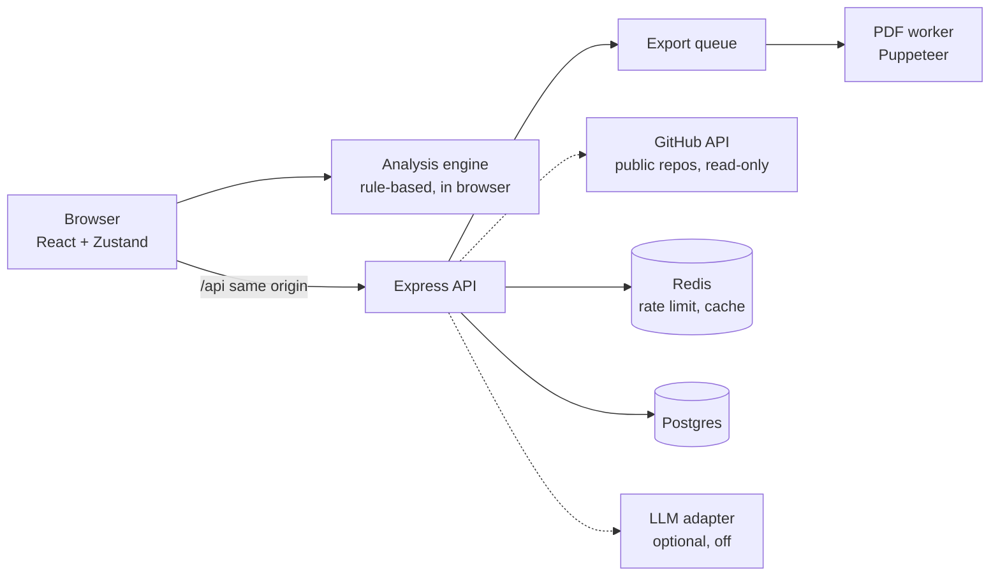
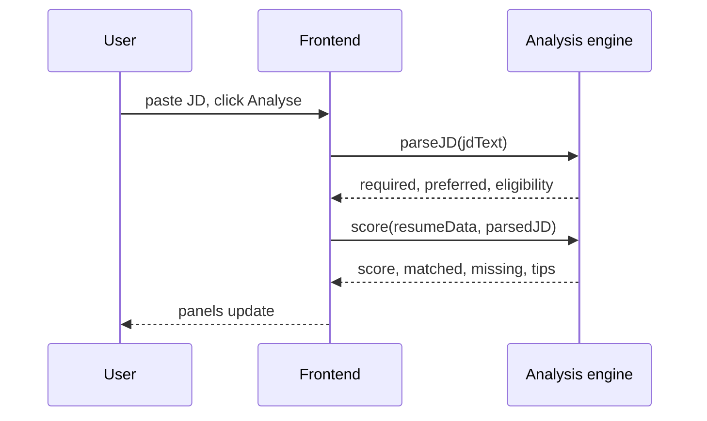
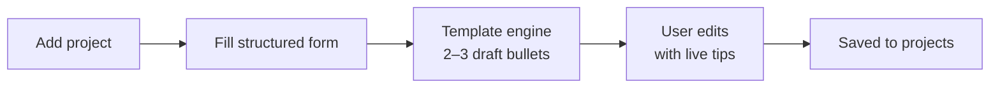

# AI Resume Builder — Target Architecture & Workflow v2

Last updated: 24 Sep 2026 · Abhayditya Pratap Singh

## 1. Purpose and current state

This doc replaces PROJECT_ARCHITECTURE.md as the single target design. It keeps what already works from Phases 1–2, fixes the known gaps, and sets the structure for Phases 3–5. The project runs with no paid APIs: all analysis is rule-based, and the LLM layer stays in the code as an optional add-on, off by default.

**What works today (keep as is):**

- One shared renderer (`renderResumeHTML`) feeds both the live preview and the Puppeteer PDF, so they cannot drift.
- Every user value is HTML-escaped; the preview iframe is fully sandboxed; download filenames are sanitized.
- All LLM calls are scoped, backend-only, rate-limited, and return Zod-validated output via `messages.parse()`.
- The ATS validator is rules-based and runs before every download.
- Resume data persists in localStorage via Zustand; nothing is stored server-side.

**What this doc fixes:**

| Problem | Impact | Fixed in |
| --- | --- | --- |
| Tailor overwrites the original bullet | User loses their own words; no undo | Sections 5, 6 |
| Keyword gap and match score need a paid LLM | No analysis without an API key; scores vary per click | Section 7 (rule-based engine) |
| Page width 800px vs A4 794px; no page breaks in preview | PDF may wrap or break differently from preview | Section 8 |
| Puppeteer not locked down; unsafe link schemes allowed | SSRF and malicious links once deployed | Sections 8, 11 |
| Data model is generic, unversioned | Missing Class X/XII, CGPA, achievements, coding profiles; no migrations | Section 5 |
| Rate limiter is in-memory and per-IP without `trust proxy` | All users share one bucket after deploy | Sections 11, 12 |
| Repo runs from `/mnt/c` under WSL | Broken hot reload, no watch mode, 25 s backend start | Section 12 |

## 2. Design principles

Every later decision in this doc follows from these seven rules.

1. **The user's words are the source of truth.** Nothing rewrites the user's text automatically. Any suggestion is stored beside the original, never as a replacement.
2. **Deterministic by default.** Rendering, validation, JD parsing, scoring and bullet checks are code. An LLM is an optional add-on, never a dependency.
3. **One renderer, one page size.** Preview and PDF share `renderResumeHTML` and a physical A4 page (210 × 297 mm).
4. **Never invent facts.** Suggestions are built only from the user's own data. If AI is enabled later, a fabrication guard checks this in code.
5. **Zero running cost first.** Every core feature runs on free tiers; paid services are added only once usage justifies them.
6. **Least privilege.** No write scopes on GitHub, no JavaScript or network in the PDF renderer, no secrets in the browser.
7. **Local-first, sync later.** The app works fully without an account; accounts add sync and history, not core features.

## 3. Target system architecture

The system is a React SPA, one Express API, a separate PDF worker, Postgres and Redis. The browser talks only to the API, through a same-origin `/api` proxy.



The browser owns editing state and runs all JD analysis itself, so Analyse costs nothing and works offline. The API owns PDF export, resume import, GitHub repo fetching, and (later) accounts. Postgres, Redis and the separate worker arrive in Phase 4; until then, the API runs Puppeteer in-process behind the same interfaces. Dashed boxes stay switched off until they are needed (GitHub is switched off only in the sense that nothing calls it until the user enters a username).

| Component | Responsibility | Never does |
| --- | --- | --- |
| Frontend (React + Zustand) | Form editing, live preview, bullet tips, project form, local persistence | Call GitHub or any LLM directly; hold secrets |
| `packages/templates` | `renderResumeHTML(resumeData, templateId)` + template CSS + embedded fonts | Access the network or DOM APIs |
| `packages/schema` | Zod schema for `resumeData`, versions and migrations, shared by frontend and backend | Contain business logic |
| `packages/text` (analysis engine) | Skill dictionary, JD parsing, match score, keyword gap, eligibility checks, bullet checks, project bullet templates, JD-vs-repo scoring; runs in browser and server | Call any external API |
| Express API | Validation, rate limiting, PDF export, resume import, GitHub repo fetching, (later) auth | Render PDFs in-process (after Phase 4); write to GitHub |
| ATS validator | Rules on content and on text extracted from the final PDF | Block download (warnings only) |
| PDF worker | Headless Chrome, JS off, network off, queued with a concurrency cap | Store PDFs |
| LLM adapter (optional, off) | Bullet tailoring, resume import mapping, with fabrication guard | Run unless `AI_ENABLED=true` |

## 4. Repository structure

Move to an npm-workspaces monorepo with three shared packages. The existing `shared/templates/` becomes `packages/templates`; nothing about the renderer changes.

```
ai-resume-builder/
├── packages/
│   ├── schema/            # Zod schema, types, migrations (v1 → v2 …)
│   │   ├── resumeData.js
│   │   └── migrations/
│   ├── templates/         # renderResumeHTML, escapeHtml, safeUrl, CSS, fonts (base64)
│   │   ├── classic/
│   │   ├── modern/
│   │   └── render.js
│   └── text/              # analysis engine
│       ├── skills.json    # skill dictionary with aliases and groups
│       ├── parseJD.js
│       ├── score.js
│       ├── bulletChecks.js
│       ├── projectBullets.js  # form answers → template bullets
│       └── resumeToPlainText.js
├── frontend/
│   └── src/
│       ├── builder/       # FormPanel, PreviewPanel, BulletTips
│       ├── analysis/      # JDInput, MatchScorePanel, KeywordGapPanel, EligibilityPanel
│       ├── projects/      # (Phase 3) ProjectForm, DraftBullets
│       ├── state/         # resumeStore (persisted), appStore (memory)
│       └── api/client.js
├── backend/
│   └── src/
│       ├── routes/        # health, export, import, github, (later) auth, resumes
│       ├── services/
│       │   ├── atsValidator.js
│       │   ├── pdf/       # renderer.js, queue.js, browserPool.js
│       │   ├── pdfImport.js
│       │   └── githubRepos.js
│       ├── llm/           # OPTIONAL, off by default
│       │   ├── adapter.js, models.js, usage.js
│       │   ├── fabricationGuard.js
│       │   └── prompts/
│       ├── middleware/    # rateLimit, requireAI, auth, errorHandler
│       └── server.js
├── tests/analysis/        # labelled JDs and resumes for the analysis engine
├── docs/ARCHITECTURE.md   # this doc
├── README.md
└── package.json           # workspaces: packages/*, frontend, backend
```

Rules: `packages/*` have no dependency on Express or React, so the analysis engine runs in both the browser and the server. Everything under `backend/src/llm/` loads only when `AI_ENABLED=true`; the app must build and run with that folder unused.

## 5. Data model v2

`resumeData` gains a schema version, Indian placement fields, structured project details, and bullets that keep the original beside any suggestion. The schema lives in `packages/schema` and is validated with Zod on both sides.

### 5.1 resumeData (v2)

```json
{
  "schemaVersion": 2,
  "personal": { "name": "", "email": "", "phone": "", "location": "",
                "links": [{ "type": "linkedin|github|portfolio|leetcode|codechef|codeforces|other", "url": "" }] },
  "summary": { "text": "" },
  "education": [{
    "id": "", "level": "btech|mtech|bsc|class12|class10|other",
    "institution": "", "degree": "", "branch": "", "board": "",
    "start": "2022-08", "end": "2026-05",
    "score": { "type": "cgpa|percentage", "value": 8.4, "outOf": 10 }
  }],
  "experience": [{ "id": "", "company": "", "role": "", "type": "internship|fulltime|parttime",
                   "start": "", "end": "", "bullets": ["<Bullet>"] }],
  "projects": [{ "id": "", "title": "", "source": "form|import|github",
                 "form": { "problem": "", "built": "", "role": "", "result": "",
                           "keyFeature": "", "teamSize": null },
                 "link": "", "start": "", "end": "",
                 "techStack": [""], "bullets": ["<Bullet>"] }],
  "skills": [{ "id": "", "group": "Languages", "items": ["Java", "Python"] }],
  "achievements": [{ "id": "", "text": "" }],
  "responsibilities": [{ "id": "", "role": "", "org": "", "start": "", "end": "", "bullets": ["<Bullet>"] }],
  "certifications": [{ "id": "", "name": "", "issuer": "", "date": "" }],
  "layout": { "templateId": "classic", "sectionOrder": ["education", "skills", "projects"], "hidden": [] }
}
```

### 5.2 Bullet object

```json
{
  "id": "b_7f3a",
  "original": "Built a REST API for hostel complaints using Node and MongoDB",
  "suggestion": {
    "text": "Built a Node.js REST API with MongoDB to handle hostel complaint tracking",
    "note": "Reordered to lead with the stack named in the JD.",
    "jdHash": "sha256:…",
    "guard": { "passed": true, "flagged": [] },
    "createdAt": "2026-09-24T10:00:00Z"
  },
  "accepted": "original"
}
```

In the no-AI setup, `suggestion` stays empty and `accepted` stays `"original"`; the user edits `original` directly with the help of bullet tips. The fields exist now so that enabling AI later needs no data migration. When a suggestion exists, the renderer prints `suggestion.text` only if `accepted` is `"suggestion"`, and Revert sets it back, so nothing is ever lost.

### 5.3 Rules

- Dates are `YYYY-MM` strings; `"present"` is allowed for `end`.
- URLs must be `https:` (or `mailto:` for email); anything else is rejected at input and again in the renderer.
- Every array item has a stable `id` for React keys, suggestions and section ordering.
- Migrations: Zustand `persist` gets `version: 2` and a `migrate` function that calls `packages/schema/migrations`. v1 → v2 wraps each string bullet as `{ id, original, accepted: "original" }`, splits `skills` into one "Skills" group, gives existing projects `source: "form"` with an empty `form`, and moves `meta.selectedTemplateId` to `layout.templateId`.
- Analysis results are not part of `resumeData`. They live in memory with the `resumeHash` + `jdHash` they were computed from.

### 5.4 Database tables (Phase 4)

| Table | Key columns | Notes |
| --- | --- | --- |
| users | id, email, name, auth_provider, created_at | Google sign-in or email magic link |
| resumes | id, user_id, title, resume_data (JSONB), schema_version, updated_at | The base resume |
| resume_variants | id, resume_id, jd_id, overrides (JSONB), created_at | Per-JD accepted suggestions and section order only |
| jds | id, user_id, jd_hash, raw_text, parsed (JSONB), created_at | Parsed once, reused |
| analyses | id, resume_id, jd_id, resume_hash, score, report (JSONB), created_at | History of scores |
| llm_usage | id, user_id, touchpoint, model, input_tokens, output_tokens, cost_inr, created_at | Cost tracking and limits (only if AI is enabled) |
| github_links | user_id, username, connected_at | Remembers a signed-in user's GitHub username so they don't retype it each visit; username only, no tokens stored. The import feature itself (Section 9.4) doesn't need this table — it works today, signed out, by asking for the username each time |

## 6. Core user workflows

Five workflows cover the product: start, edit, analyse a JD, improve bullets, export. Adding projects is covered in Section 9.

### 6.1 Start: template or import

1. The user picks a template in the gallery, or uploads an existing resume PDF (Phase 2.5).
2. Import: the backend extracts the PDF text with `pdf-parse`. A rule-based parser pulls email, phone and links with patterns, and splits the rest by common headings (Education, Projects, Skills, Experience). A review screen shows each chunk beside the matching form fields; the user confirms or moves text, and nothing is saved until Accept.
3. The builder opens with the data in the form and the preview on the right.

### 6.2 Edit (unchanged path, three additions)

Keystroke → Zustand action → store update → 120 ms debounce → `renderResumeHTML` → iframe `srcDoc` → persist to localStorage. Additions:

- The preview page is 210 mm wide and draws a dashed line every 297 mm, labelled "Page 2 starts here".
- Every edit updates `resumeHash`. Analysis panels whose hash no longer matches show "Outdated: re-run Analyse".
- A "Download backup (.json)" and "Restore from backup" pair sits in the header menu.

### 6.3 Analyse a JD



Analysis runs entirely in the browser in well under a second. It costs nothing, works offline, and gives the same score for the same resume and JD every time. The panels show the score breakdown, matched and missing skills (critical or nice-to-have), and eligibility checks such as a CGPA cutoff or allowed branches.

### 6.4 Improve a bullet (rule-based tips)

1. Every bullet gets live tips from the bullet checks (Section 7.4), shown as small chips under it: "Start with an action verb", "Add a number", "Too long".
2. After Analyse, tips add JD-aware hints built only from the user's own data, for example: "This project's tech stack lists Docker, which the JD requires. Mention it if you used it."
3. The user edits the bullet themselves, and the tips update as they type. Nothing is rewritten automatically, so the original is never lost.

If the optional AI layer is enabled later, a Tailor button returns and fills `bullet.suggestion`, with Accept and Revert as described in Section 5.2. Nothing is ever auto-accepted.

### 6.5 Export

1. `POST /api/export/validate` runs content rules and returns warnings.
2. `POST /api/export/pdf` enqueues a render job. The worker renders, then extracts text from the PDF and checks section order and page count.
3. The PDF streams back with any post-render warnings in a response header; the UI shows them next to the download.

## 7. Analysis engine (rule-based) and optional AI layer

Every analysis feature runs in code in `packages/text`, with no API cost. The LLM code stays in the repo, switched off, and can be turned on later without changing any other part.

### 7.1 Skill dictionary

`packages/text/skills.json` holds about 500 skills in groups (Languages, Frameworks, Databases, Cloud/DevOps, Data/BI, Tools, Concepts), each with aliases:

```json
{ "id": "react", "name": "React", "group": "Frameworks", "aliases": ["reactjs", "react.js"] }
```

It also covers analyst-role terms (Excel, Power BI, SQL, stakeholder reporting). It is maintained by hand and grows from the test set (Section 13) and a "Report a missing skill" link in the UI.

### 7.2 JD parsing

1. Normalize the text: lowercase, and keep symbols that matter in skill names (C++, C#, .NET, Node.js).
2. Split into sections by headings. "Requirements", "Must have", "Qualifications" → required. "Good to have", "Preferred", "Bonus" → preferred. No heading → required.
3. Match dictionary aliases with word-boundary patterns, longest first, so "Spring Boot" wins over "Spring".
4. Guard ambiguous short names (Go, R, C) by requiring nearby context such as "language", "programming" or another skill in a list.
5. Extract eligibility: CGPA or percentage cutoffs, allowed branches, graduation year. These are checked against the education section.

### 7.3 Scoring engine

1. Normalize skills on both sides with the dictionary, so "ReactJS" and "React.js" count as React.
2. Count required and preferred skills found anywhere in the resume text.
3. Score = 70 × (matched required ÷ total required) + 20 × (matched preferred ÷ total preferred) + 10 × (skills also mentioned in a bullet ÷ matched skills).
4. Missing skills = required first (critical), then preferred (nice-to-have).
5. Section ordering: projects and experience sorted by how many JD skills each contains; shown as a suggested order the user can apply.

The last term rewards showing a skill in real work, not only in the skills list. Tune the weights against the test set, and show the breakdown so the number is explainable.

### 7.4 Bullet checks

| Check | Rule | Tip shown |
| --- | --- | --- |
| Weak opening | Starts with "worked on", "responsible for", "helped", "involved in" | Start with an action verb: Built, Designed, Reduced, Automated |
| No action verb | First word not in the action-verb list | Lead with what you did |
| No result | No number, percentage or measurable outcome | Add a number: users, time saved, accuracy, size of data |
| Passive voice | "was developed", "were created" | Say who did it: "Developed…" |
| Length | Under 60 or over 220 characters | Keep it to one or two lines |
| Unshown JD skill | JD requires a skill that is in this item's tech stack but in none of its bullets | Mention it if you used it |

Every tip is built from the user's own data or fixed rules, so nothing suggested can be invented.

### 7.5 Optional AI layer (off by default)

- Enabled only with `AI_ENABLED=true` and a key; otherwise the backend never loads `llm/` and the UI hides AI buttons.
- The adapter supports any provider, so a free tier or a local model (Ollama, for development) can be tried without code changes elsewhere.
- Candidate features when enabled: bullet tailoring, smarter resume import. (Polishing project bullets and GitHub-assisted import were considered and dropped — Section 9.3–9.4.)
- Rules that apply when enabled: fabrication guard on every rewrite, structured JSON output, user text treated as data, per-call usage logging, and a daily spend cap. Do not use any free tier that trains on submitted data unless each user gives clear consent.

## 8. Rendering, ATS validation and PDF export

The shared renderer stays; the page becomes true A4, the browser gets locked down, and validation checks the real PDF instead of only the input.

### 8.1 Renderer changes

- `.page { width: 210mm; min-height: 297mm; }` replaces the 800px width. The preview scale factor is computed from the element's real pixel width.
- `@page { size: A4; margin: 0; }` in the template CSS, and `page.pdf({ preferCSSPageSize: true })`.
- `break-inside: avoid` on every experience, project and education entry; `break-after: avoid` on section headings.
- All fonts are embedded as base64 `@font-face` in the template package. No remote fonts.
- A `safeUrl()` helper in the renderer drops any link that is not `https:` or `mailto:`, even if the input check was bypassed.
- Sections render in `layout.sectionOrder`, skipping `layout.hidden`.

### 8.2 Puppeteer hardening

| Control | Setting |
| --- | --- |
| JavaScript | `page.setJavaScriptEnabled(false)` |
| Network | Request interception: allow only `data:` and `about:blank`; abort everything else |
| Timeouts | `setContent` 10 s, `pdf()` 15 s |
| Page lifecycle | Open page per job; close in `finally` |
| Browser crash | Listen for `disconnected`; relaunch on next job |
| Concurrency | Queue with max 2 concurrent renders per worker; reject with 503 + retry-after when the queue exceeds 20 |
| Launch flags | `--no-sandbox` only inside a container; `--disable-dev-shm-usage` |

### 8.3 ATS validator

The validator runs in two stages and never blocks the download.

**Before render (content rules):** name, email and phone present; phone matches Indian or international format; at least one education and one skills entry; bullet length 60–220 characters; dates in order; no pending (unreviewed) suggestions left; non-ASCII outside an allowlist (₹, –, —, accented letters, Indian scripts in the name) shown as an info note, not a warning.

**After render (PDF checks, `backend/src/services/postRenderCheck.js`):** extract text with `pdf-parse`; confirm section headings appear in the same order the renderer itself produced them (a mismatch means Puppeteer/CSS/page breaks reordered something, not that the input was wrong — the expected order comes from parsing the renderer's own `<h2>` output, not from re-deriving it); confirm name and email are extractable; add an info note (not a warning — page count alone isn't wrong) when the PDF is more than one page. Attached to the `/api/export/pdf` response as a base64 `X-Ats-Post-Render` header (HTTP headers are ISO-8859-1, so raw JSON isn't safe there) and merged into the same report the pre-render checks populate.

Template-level rules (single column, no tables, no images, real text) are enforced by automated tests on every template at build time, not at runtime.

### 8.4 Filename

Sanitize to ASCII alphanumerics, hyphen and underscore. If the result is empty (for example, a name in Devanagari or Tamil script), fall back to `resume.pdf`.

## 9. Projects: structured form and template bullets (Phase 3)

Students describe each project in a short structured form, and bullets are generated from templates in code. This replaces pulling READMEs from GitHub: it works for any project (college, hackathon, private or not on GitHub), costs nothing, and cannot invent facts because every word comes from the student's answers.



### 9.1 The project form

| Field | Required | Example |
| --- | --- | --- |
| Title | Yes | Hostel Complaint Tracker |
| Problem it solved | Yes | Hostel complaints were tracked on paper and often lost |
| What you built | Yes | A web app for students to file and track complaints |
| Your role | Yes (default: "Built it solo") | Built the backend and database |
| Tech used | Yes | Node.js, Express, MongoDB (picked from the skill dictionary, with autocomplete) |
| Result or scale | No, but encouraged | Used by 300 students in my hostel |
| Key feature | No | Email alerts when a complaint is resolved |
| Link | No | GitHub repo or live demo (`https:` only) |
| Dates, team size | No | Jan–Mar 2026, team of 3 |

The form shows a hint under "Result or scale" ("Users, time saved, accuracy, data size, rank in a hackathon"), because a number is the single biggest improvement to a student bullet.

### 9.2 Template bullet generation

`packages/text/projectBullets.js` turns form answers into 2–3 draft bullets. It picks templates by which fields are filled:

| Fields available | Template |
| --- | --- |
| What, tech, problem | Built {what} using {tech} to {problem, as a goal} |
| Role, what, result | {Role verb} {role object} for {what}, {result} |
| Key feature, tech | Implemented {key feature} with {one tech item} |
| Result only | Delivered {result} |

Example output for the form above: "Built a complaint-tracking web app using Node.js, Express and MongoDB to replace paper-based tracking" and "Designed the backend and database, serving 300 hostel students."

Rules: templates never add words that change meaning (no "scalable", "high-performance"); verbs come from the action-verb list; drafts go through the same bullet checks as hand-written ones. Drafts appear as editable text, and the student's edits are what gets saved.

### 9.3 Descoped: Polish with AI

**Decision (Sept 2026): dropped, not building.** The generic per-bullet Tailor button (Section 6.4) already covers AI rewriting for any bullet, project bullets included, when `AI_ENABLED=true`. A project-specific variant would have duplicated that with no real gain, so it isn't on the roadmap.

### 9.4 Import from GitHub, ranked against the JD

**Revised design (Sept 2026).** The original plan here — a plain "pull in my repo's name and tech stack" autocomplete — was dropped: for a student with only a couple of projects, it saves typing but doesn't change what goes on the resume. What replaced it does: the student pastes a JD (which they're already doing for Analyse), and their GitHub repos are ranked by how well each one's tech stack matches that specific JD, so someone with many repos sees which ones are actually worth featuring for *this* application rather than reusing the same fixed project list every time. Still no LLM, no API key, no OAuth.

1. The user enters a GitHub username. `backend/src/services/githubRepos.js` fetches their public, non-fork repos (capped at 12, most recently updated first) via GitHub's plain REST API — no user token needed for public data.
2. For each repo, tech stack comes from its manifest file first (`package.json`, `requirements.txt`, `go.mod` — read in that order, first one found wins) mapped through the skill dictionary, then falls back to the repo's GitHub-reported languages if no manifest is found or parseable. `pom.xml`/`build.gradle` aren't parsed (XML/DSL, not a quick key list) — a Maven/Gradle repo still gets a techStack from its languages alone.
3. `shared/text/repoScore.js` — pure, no network — scores each repo against the same `parsedJD` used for the résumé's own match score: required skills count double, preferred once, identical weighting logic to `scoreResume()`, just aimed at one repo's tech stack instead of a whole résumé.
4. The ranked list shows each repo's score and *why* it matched ("React, MongoDB — both required"), with a checkbox per repo — nothing is imported until the user picks and clicks Import, same review-before-save posture as PDF import.
5. An imported repo pre-fills Title, Tech used, and Link (mapped to canonical skill names, matching the rest of the project form). The student still answers Problem, Role and Result themselves, then generates bullets the same way as any manually-entered project (Section 9.2).

**Rate limit:** unauthenticated GitHub API access is 60 requests/hour, and fetching one repo costs 2 calls (manifest + languages) on top of the initial listing call — enough for a handful of imports before hitting it. `GITHUB_SERVER_TOKEN` (any scope-less PAT) raises that to 5,000/hour; it's optional, the feature works without it, just with a lower ceiling. No Redis caching layer for this first version — worth adding once there's enough traffic to justify it, not before.

## 10. Accounts, persistence and sync (Phase 4)

Accounts are optional and add sync, per-JD variants and history. The app stays fully usable signed out, with localStorage as today.

- **Sign-in:** Google sign-in (students have college Google accounts) plus email magic link. GitHub is not a login.
- **Optional auth middleware:** it attaches `req.user` when a session exists and never blocks a request. Existing routes work for everyone; only account features (saved resumes, variants) check for a user.
- **Session:** httpOnly, `Secure`, `SameSite=Lax` cookie. Because the frontend proxies `/api` through the same origin (Vercel rewrites), no cross-site cookie issues arise.
- **First sign-in:** the local resume uploads to the server once, after the user confirms. After that, the server copy is the source of truth and localStorage is a cache.
- **Sync:** debounced save (2 s) with `updated_at` as a version check. On conflict (two tabs or devices), keep both and ask the user which to keep.
- **Variants:** a variant stores only what differs for one JD: accepted suggestions and section order. The base resume stays clean; switching JD switches the variant.
- **Deletion:** "Delete my account" removes the user, resumes, variants, JDs, analyses and usage rows immediately.

## 11. Security and privacy

The main risks are the server-side browser, abuse of export, and personal data in resumes. Each has a named control.

| Risk | Control | Status |
| --- | --- | --- |
| HTML injection into templates | `escapeHtml` on every interpolation; test that fails on any raw interpolation | Done |
| Malicious links (`javascript:`, `file:`) | Input validation + `safeUrl()` in renderer | To do |
| SSRF via Puppeteer | JS off, network blocked, timeouts (Section 8.2) | To do |
| Export and AI abuse | PDF export rate-limited per user or IP. Only if AI is enabled: Redis rate limit (15/min, 100/day) and a global daily spend cap with alert | Partly done (in-memory) |
| Wrong client IP behind proxy | `app.set('trust proxy', 1)` on the deployed API | To do |
| Prompt injection via JD | Only relevant if AI is enabled: text wrapped as data; output schema-validated; output goes only to the same user | Partly done |
| Oversized input | 1 MB JSON limit; JD capped at 15,000 characters | Partly done |
| Secrets exposure | Keys server-side only; `.env` never committed; secret scanning on the repo | Done |
| Personal data sent to an LLM | Not applicable while AI is off. If enabled: consent line before first AI use and a privacy page listing what is sent and to whom | To do |
| Data retention | No PDFs stored; account deletion is immediate; logs never contain resume text | To do |

India's DPDP Act 2023 applies once you store personal data server-side. Before Phase 4 launch, add a clear notice, consent at sign-up, and a working deletion flow.

## 12. Dev environment, deployment and operations

Move the repo into the WSL filesystem now, and deploy with Docker so Chrome's dependencies stop being machine-specific.

### 12.1 Local development

- Clone to `~/projects/ai-resume-builder` (inside WSL, not `/mnt/c`). This restores file watching, so remove `usePolling` from `vite.config.js` and bring back `node --watch` for the backend.
- One command, `npm run dev`, starts both processes with `concurrently`.
- A `Dockerfile` for the backend installs Chrome and its system libraries. It replaces the `~/.local/lib/chrome-deps` workaround for anyone other than you.
- `docker compose up` adds Postgres and Redis locally once Phase 4 starts.

### 12.2 Deployment

| Piece | Host | Notes |
| --- | --- | --- |
| Frontend | Vercel | Rewrite `/api/*` to the API for same-origin cookies |
| API | Render or Railway (Docker) | Paid tier before launch to avoid cold starts |
| PDF worker | Same Docker image, separate service | Needs about 1 GB RAM for Chrome with 2 concurrent renders |
| Postgres | Managed (Neon, Supabase or Render) | Check free-tier expiry terms before relying on one |
| Redis | Upstash or Render | Rate limits and caches |

### 12.3 Operations

- Traffic is seasonal and spikes near placement registration deadlines (roughly August to December). Load-test exports at 20 concurrent users before the season.
- Log each request with a request ID.
- Alerts: PDF error rate above 5%, API p95 latency above 3 s, and (if AI is enabled) daily LLM spend above the cap.
- `/api/health` reports API, Redis, DB, worker queue depth and AI availability. The frontend re-checks it every 60 s while it reports down.

### 12.4 Environment variables

```
NODE_ENV=
PORT=
FRONTEND_ORIGIN=
DATABASE_URL=
REDIS_URL=
SESSION_SECRET=
GOOGLE_CLIENT_ID=
GOOGLE_CLIENT_SECRET=
PUPPETEER_EXECUTABLE_PATH=
GITHUB_SERVER_TOKEN=        # optional; raises the GitHub import rate limit from 60/hr to 5,000/hr

# Optional AI layer: leave AI_ENABLED=false
AI_ENABLED=false
LLM_PROVIDER=
LLM_API_KEY=
LLM_MODEL_FAST=
LLM_MODEL_STRONG=
LLM_DAILY_SPEND_CAP_INR=
```

## 13. Testing

Code is tested with ordinary unit and end-to-end tests; the analysis engine is tested against a fixed set of real, hand-labelled JDs.

| Layer | Tool | What it checks |
| --- | --- | --- |
| Schema and migrations | Vitest | Every v1 fixture migrates to valid v2 without losing a bullet |
| Renderer | Vitest | Escaping of hostile strings; `safeUrl`; section order; hidden sections |
| Templates | Vitest + Puppeteer | Each template: one column, no tables or images, text extractable, headings in order |
| Scoring engine | Vitest | Synonyms, weights, same input gives same score |
| JD parser and bullet checks | Vitest | 30 labelled JDs parse to the expected required and preferred skills; tips fire on known weak bullets |
| Project bullet templates | Vitest | Every word in a draft traces to a form answer or a fixed template word |
| API | Supertest | Rate limits, validation errors, filename fallback, app works with AI disabled |
| End to end | Playwright | Gallery → edit → add project → Analyse → follow a tip → Download, with no API key set |

### 13.1 Analysis test set (`tests/analysis/`)

- 30 real JDs across SDE, analyst and trainee roles, with hand-labelled required and preferred skills, plus 20 anonymized student resumes.
- `npm run test:analysis` reports parser precision and recall per JD and lists skills missing from the dictionary.
- Pass bar: recall of at least 90% on required skills, and no false matches on common words (Go the verb, the letter R or C).
- Every missed skill is added to the dictionary together with a test.

### 13.2 If the AI layer is enabled later

1. Build an eval set of bullets and project forms, and run every AI feature over it before release.
2. Pass bar: 100% schema-valid output and zero unflagged fabrications.
3. Log tokens per call to estimate cost per user before opening it to everyone.

## 14. Roadmap

Fix what exists first (Phase 2.1), then deepen analysis (Phase 2.5) before building the project form. Each phase has an exit test.

### Phase 2.1 — Fix now (about 1 week)

- [ ] Move repo into WSL filesystem; restore watch mode; single `npm run dev`
- [ ] Put AI buttons and routes behind `AI_ENABLED=false`; keep the LLM code but out of the default flow
- [ ] Bullet object with `original` / `suggestion` / `accepted` fields (ready for AI later); v1 → v2 migration
- [ ] `.page` width to 210 mm; `@page` rule; `break-inside: avoid`; page-boundary lines in preview
- [ ] `safeUrl()`; Puppeteer JS off, network blocked, timeouts, page close in `finally`, crash relaunch
- [ ] Filename fallback; JSON backup and restore
- [ ] README with setup steps and the Chrome dependency note

**Exit test:** the app runs fully with no API key; preview and PDF break at the same line on a 2-page resume.

### Phase 2.5 — Better analysis (2–3 weeks)

- [ ] Monorepo with `packages/schema`, `packages/templates`, `packages/text` — kept as `shared/text/` instead, alongside the existing `shared/templates/` and `shared/schema/`; revisit if the package ever needs to publish separately
- [x] Indian placement fields: Class X/XII vs. degree level, structured CGPA/percentage score, branch/board, skill groups (already done), achievements, positions of responsibility, CodeChef/Codeforces links
- [x] Skill dictionary (SDE scope, ~130 skills with aliases — analyst/core branches deferred per the Sept 2026 scope decision) and rule-based JD parser, running in the browser
- [x] Scoring engine, keyword gap, eligibility checks, suggested section order
- [x] Bullet checks and JD-aware tips
- [x] Resume import from PDF (rule-based, with review screen) — entry-level splitting depends on the source PDF's bullets carrying a glyph (•, -, etc.); resumes without one degrade to one entry per line, still reviewable, never dropped
- [x] Post-render PDF text checks (section 8.3): name/email extractable, section-heading order matches the renderer's own output, page-count info note — attached to the PDF response as a header, merged into the same ATS report the pre-render checks already show
- [ ] Analysis test set grown to 30 JDs — 8 labelled JDs in `tests/analysis/` so far, recall asserted ≥90%; grow toward 30 as real JDs are collected

**Exit test:** the same resume and JD give the same score every time; parser recall is at least 90% on required skills in the test set.

### Phase 3 — Project form and template bullets (1–2 weeks)

- [x] Structured project form with tech autocomplete from the skill dictionary
- [x] `projectBullets.js` template engine, with drafts shown as editable text
- [x] Project form fields are part of schema v2; existing v1 projects migrate with an empty form and their bullets kept as they are
- ~~"Polish with AI" on generated drafts (section 9.3)~~ — **descoped (Sept 2026)**, see section 9.3
- [x] Import from GitHub, revised to rank repos against the pasted JD instead of a plain autocomplete (section 9.4) — no LLM, reuses the JD-parsing and skill-matching engine already built for résumé scoring

Phase 3 is done: every planned item is either shipped or explicitly dropped.

**Exit test:** a student with no GitHub account can add a project and get 2–3 usable bullets in under 2 minutes; every word in a draft traces to a form answer or a fixed template word — enforced by a dedicated test in `tests/projects/projectBullets.test.js` that tokenizes every generated draft and asserts every word traces to the form/tech input or a small fixed vocabulary.

### Phase 4 — Accounts and scale (3–4 weeks)

- [ ] Google sign-in and magic link (optional auth middleware); Postgres; sync; per-JD variants
- [ ] Redis rate limits, `trust proxy`; separate PDF worker with queue
- [ ] Docker deployment; monitoring and alerts; privacy notice and deletion flow

**Exit test:** 20 concurrent exports succeed under load; account deletion removes every row; the builder still works fully when signed out.

### Phase 5 — Growth (after launch)

More templates, DOCX export, resume sharing links, and placement-cell features such as batch review for a class. The optional AI layer (bullet tailoring, smarter import) comes last, once there is budget or a suitable free tier. AI polish for project bullets was considered and dropped (Sept 2026, section 9.3) — the generic Tailor button already covers it. GitHub import (section 9.4) moved up into Phase 3 instead, revised into JD-ranked repo import.

## 15. Open decisions

- [ ] Skill dictionary scope at launch: SDE roles only, or also analyst and core-branch roles.
- [ ] Scoring weights (70/20/10 is a starting point), tuned against the test set.
- [ ] Template count at launch: 2 now; add a third (compact, dense layout for students with many projects)?
- [ ] Whether and when to enable the AI layer, and with which provider (a free tier or paid).
- [ ] DOCX export: Phase 5 or earlier, depending on how many placement portals ask for Word files.
- [ ] License for the public repo (MIT or keep all rights).
- [ ] Whether resume import (Phase 2.5) should move ahead of the Indian fields, since it drives onboarding.
