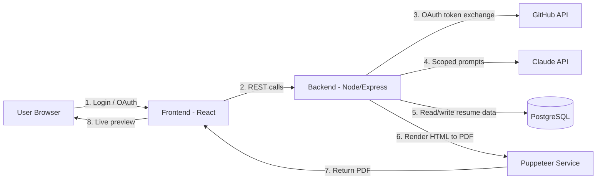

# AI Resume Builder — Project Architecture

**Project:** AI-powered resume builder with ATS-style JD matching and GitHub-based auto-portfolio generation, tailored for Indian campus placements.

**Target user:** Final-year engineering/CS students applying to campus placements (analyst, SDE, trainee roles), who need to tailor a resume per JD quickly and don't want to manually describe every GitHub project.

---

## 1. Goals & Non-Goals

**Goals (MVP)**
- Let a user build a resume via a template-first, split-screen live-preview builder
- Let a user connect GitHub (read-only) and auto-generate JD-tailored project bullets from their repos
- Let a user paste a JD and get keyword-gap analysis + tailored resume content
- Export a clean, ATS-safe PDF

**Non-goals (for now)**
- No autonomous multi-step AI agent — all LLM calls are scoped, single-purpose, backend-orchestrated
- No private-repo deep code analysis (README + language stats only, for cost/speed)
- No job-board/application-tracking features in v1
- No native mobile app in v1 — web only

---

## 2. Tech Stack (suggested default — adjust freely)

| Layer | Choice | Why |
|---|---|---|
| Frontend | React (Vite) + Tailwind CSS | Fast dev, component-driven, matches the live-preview pattern |
| Backend | Node.js + Express | Simple REST API, easy GitHub/LLM API calls, one language across stack |
| Database | PostgreSQL (or SQLite for local dev) | Structured resume data, relational (users → resumes → sections) |
| Auth | GitHub OAuth App (for repo scan) + simple email/password or magic link for account | No need for a heavy auth provider at MVP scale |
| LLM Provider | Anthropic Claude API (or OpenAI, interchangeable via an adapter layer) | Scoped prompt calls, see Section 6 |
| PDF Rendering | Puppeteer (headless Chrome, HTML→PDF) | Most reliable way to get pixel-accurate, ATS-safe PDF from styled HTML |
| Hosting | Vercel (frontend) + Render/Railway (backend + DB) | Free/cheap tiers, zero upfront infra cost |
| File storage | None needed at MVP (PDFs generated on-demand, not stored long-term) | Keeps cost near zero |

---

## 3. High-Level Architecture



**Flow in words:**
1. User logs in / signs up
2. User optionally connects GitHub (OAuth, read-only scope)
3. Frontend sends form data + JD text to backend as it changes (or on "Analyze" click)
4. Backend calls GitHub API (if connected) to pull repo data
5. Backend calls LLM API for each scoped task (see Section 6)
6. Backend stores/updates the structured resume record in Postgres
7. Frontend re-renders the live preview pane from the returned `resumeData`
8. On "Download," backend renders the final HTML through Puppeteer → PDF → sent to user

---

## 4. Suggested Folder Structure

```
resume-builder/
├── frontend/
│   ├── src/
│   │   ├── components/
│   │   │   ├── TemplateGallery/
│   │   │   ├── Builder/
│   │   │   │   ├── FormPanel/          # left pane, sectioned form
│   │   │   │   │   ├── PersonalDetails.jsx
│   │   │   │   │   ├── Summary.jsx
│   │   │   │   │   ├── Experience.jsx
│   │   │   │   │   ├── Education.jsx
│   │   │   │   │   ├── Skills.jsx
│   │   │   │   │   ├── Projects.jsx
│   │   │   │   │   └── Certifications.jsx
│   │   │   │   ├── PreviewPanel/       # right pane, live render
│   │   │   │   │   └── templates/
│   │   │   │   │       ├── TemplateA.jsx
│   │   │   │   │       ├── TemplateB.jsx
│   │   │   │   │       └── ...
│   │   │   │   ├── JDInput.jsx
│   │   │   │   ├── GitHubConnect.jsx
│   │   │   │   ├── MatchScorePanel.jsx
│   │   │   │   └── KeywordGapPanel.jsx
│   │   │   └── shared/
│   │   ├── state/
│   │   │   └── resumeStore.js          # central resumeData state (Zustand/Redux/Context)
│   │   ├── api/
│   │   │   └── client.js               # wraps all backend calls
│   │   └── App.jsx
│   └── package.json
│
├── backend/
│   ├── src/
│   │   ├── routes/
│   │   │   ├── auth.js
│   │   │   ├── github.js               # OAuth callback, repo fetch
│   │   │   ├── resume.js               # CRUD for resume data
│   │   │   ├── llm.js                  # all LLM-touchpoint endpoints
│   │   │   └── export.js               # PDF generation endpoint
│   │   ├── services/
│   │   │   ├── githubService.js        # GitHub API wrapper
│   │   │   ├── llmService.js           # LLM API adapter + prompt templates
│   │   │   ├── atsValidator.js         # rules-based ATS format check
│   │   │   └── pdfRenderer.js          # Puppeteer HTML->PDF logic
│   │   ├── prompts/
│   │   │   ├── githubBlurb.js
│   │   │   ├── bulletTailor.js
│   │   │   ├── keywordGap.js
│   │   │   ├── sectionRank.js
│   │   │   ├── readmeNudge.js
│   │   │   └── matchScore.js
│   │   ├── models/
│   │   │   ├── User.js
│   │   │   ├── Resume.js
│   │   │   └── db.js
│   │   └── server.js
│   └── package.json
│
├── PROJECT_ARCHITECTURE.md             # this file
└── README.md
```

---

## 5. Data Model

### 5.1 Central `resumeData` object (shared shape, frontend + backend)

```json
{
  "personal": {
    "name": "",
    "email": "",
    "phone": "",
    "location": "",
    "linkedin": "",
    "github": "",
    "portfolio": ""
  },
  "summary": "",
  "experience": [
    { "id": "", "company": "", "role": "", "startDate": "", "endDate": "", "bullets": [""] }
  ],
  "education": [
    { "id": "", "institution": "", "degree": "", "startDate": "", "endDate": "", "score": "" }
  ],
  "skills": [""],
  "projects": [
    {
      "id": "",
      "title": "",
      "source": "manual | github",
      "repoUrl": "",
      "techStack": [""],
      "bullets": [""]
    }
  ],
  "certifications": [
    { "id": "", "name": "", "issuer": "", "date": "" }
  ],
  "meta": {
    "selectedTemplateId": "",
    "targetJD": "",
    "matchScore": null
  }
}
```

### 5.2 Database tables (simplified)

- **users**: id, email, password_hash (or oauth_id), github_access_token (encrypted), created_at
- **resumes**: id, user_id, resume_data (JSONB — stores the object above), selected_template_id, created_at, updated_at
- **jd_history** (optional): id, resume_id, jd_text, match_score, created_at

---

## 6. LLM Touchpoints (backend-orchestrated, not an agent)

Each is a **separate, scoped API call** — the backend controls the sequence; the LLM never decides what to call next.

| # | Touchpoint | Input | Output | Model tier |
|---|---|---|---|---|
| 1 | GitHub blurb generation | README + language stats + JD | 2–3 line JD-tailored project bullet | Stronger model (highest fabrication risk) |
| 2 | Bullet tailoring | Existing bullet + JD | Rewritten bullet, JD-relevant phrasing | Stronger model |
| 3 | Keyword gap analysis | Resume text + JD | Ranked list of missing keywords | Cheaper/faster model |
| 4 | Section reordering | All projects/experience + JD | Ranked order by relevance | Cheaper/faster model |
| 5 | README nudge (optional) | Repo with no/weak README | Suggested README draft | Cheaper/faster model |
| 6 | Match score | Final resume + JD | Score + short summary | Cheaper/faster model |

**Anti-fabrication rule (applies to #1 and #2):** prompts must explicitly instruct the model to *only rephrase what's given* — never introduce tools, technologies, metrics, or achievements not present in the source data (README text or user-entered bullet). Validate this isn't violated by keeping the prompt scoped and reviewing early outputs manually before launch.

**Explicitly NOT LLM-driven:**
- Rendering (`resumeData` → HTML/PDF) — pure template logic
- ATS format validation — rules-based, deterministic checks (no tables, no images-as-text, selectable text, consistent headings)

---

## 7. GitHub Integration Flow

1. User clicks "Connect GitHub" → redirected to GitHub OAuth consent screen
2. Scope requested: `read:user` + `public_repo` (private repo access only if you later add a "paste additional project info" fallback isn't enough — keep to public repos for MVP to minimize trust friction)
3. GitHub redirects back with an auth code → backend exchanges it for an access token
4. Backend stores the token (encrypted) against the user record
5. Backend calls `GET /user/repos` → for each repo: `GET /repos/{owner}/{repo}/languages` + fetch `README.md` content
6. This raw data is passed into Touchpoint #1 (GitHub blurb generation) alongside the JD

---

## 8. Rendering & Export Pipeline

1. User clicks "Download"
2. Backend takes `resumeData` + `selectedTemplateId`
3. Backend server-renders the matching template component to a static HTML string (with inlined CSS)
4. Puppeteer loads that HTML in headless Chrome, prints to PDF (A4/Letter, no browser chrome)
5. PDF is streamed back to the user for download (not stored server-side, to save cost/storage)
6. Before this step, the ATS validator (Section 6) runs a final check on the HTML structure and warns the user if something will break parsing

---

## 9. Security & Privacy Notes

- Never expose the LLM API key or GitHub OAuth client secret to the frontend — all provider calls happen server-side only
- Encrypt GitHub access tokens at rest in the database
- Be explicit in your consent UI about what "Connect GitHub" actually accesses (public repos, README, language stats) — don't rely on hiding this, since GitHub's own OAuth screen already discloses scopes
- Rate-limit LLM-calling endpoints per user to control cost and prevent abuse

---

## 10. Phased Build Order (MVP first)

**Phase 1 — Core builder (no AI yet)**
- Template gallery → split-screen form/preview → manual data entry → PDF export (Puppeteer)

**Phase 2 — JD matching (LLM, no GitHub yet)**
- JD paste field → keyword gap analysis (#3) → bullet tailoring (#2) → match score (#6)

**Phase 3 — GitHub integration**
- OAuth flow → repo fetch → blurb generation (#1) → README nudge (#5)

**Phase 4 — Polish**
- Section reordering (#4), multiple templates, sharing/export options, usage limits for free tier

---

## 11. Environment Variables (backend `.env`)

```
DATABASE_URL=
GITHUB_CLIENT_ID=
GITHUB_CLIENT_SECRET=
GITHUB_CALLBACK_URL=
ANTHROPIC_API_KEY=
JWT_SECRET=
NODE_ENV=
```

---

## 12. Open Decisions (fill in as you go)

- [ ] Final template count/style for MVP launch
- [ ] Free tier limits (e.g., N free JD-matches before paywall — see GoResume's paywall backlash, avoid blocking the *entire* download)
- [ ] Which LLM model per touchpoint (cost vs quality — test with real resume-sized inputs before locking in)
- [ ] DOCX export in addition to PDF (v2 candidate)
